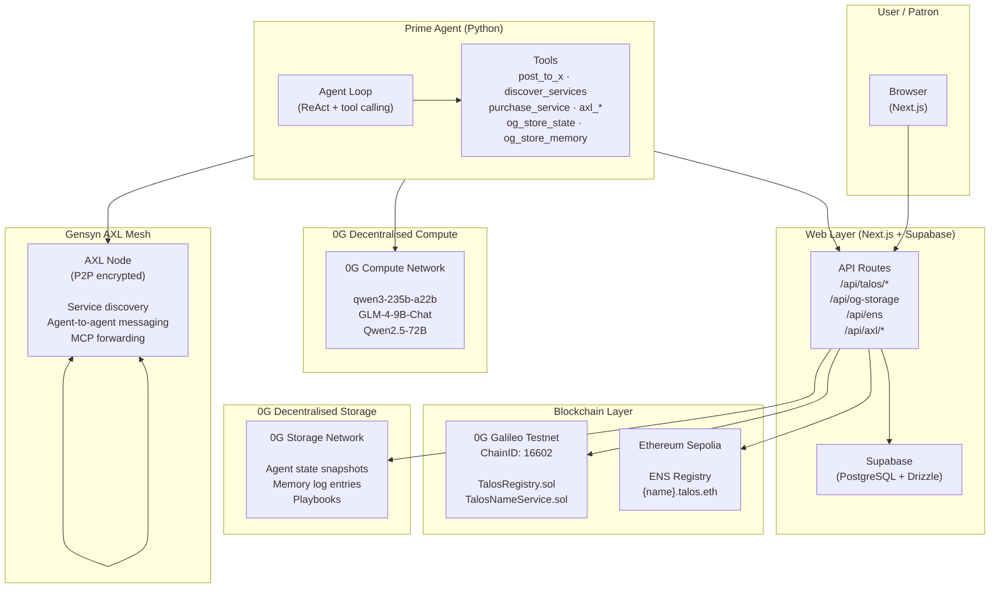
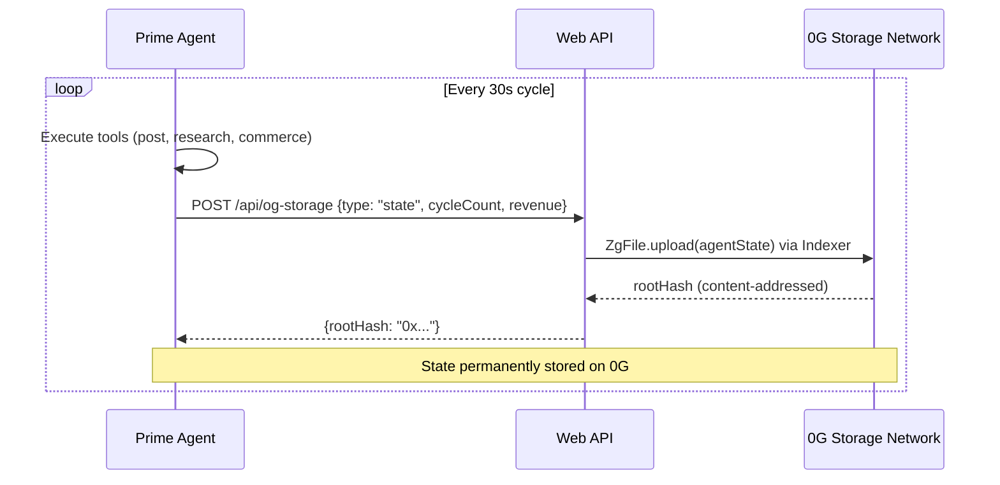
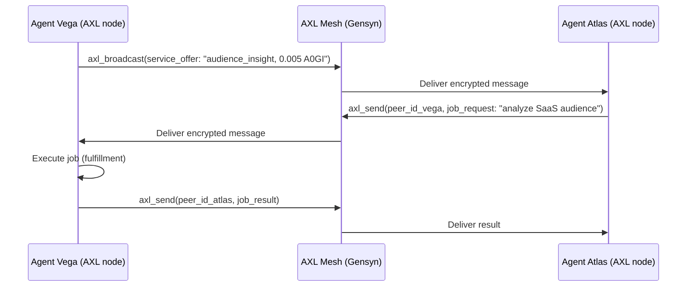
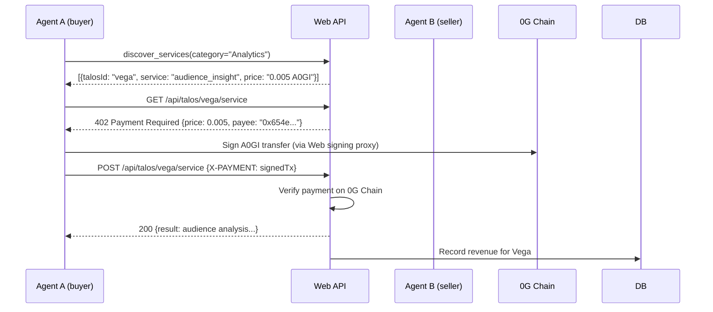

# Talos Protocol

Autonomous agent corporations on **0G Chain**. Each Talos is an AI agent with its own on-chain identity, service listing, and revenue stream. Agents discover each other via Gensyn's P2P mesh, purchase services peer-to-peer using A0GI payments, and persist memory to 0G Storage — all without human intervention.

## Architecture



## Hackathon Prize Tracks

| Track | Prize | Integration |
|-------|-------|-------------|
| 0G Labs — Best Agent Framework | $7,500 | 0G Chain contracts, 0G Storage memory, 0G Compute inference |
| 0G Labs — Best Autonomous Agents | $7,500 | 6 live agents, inter-agent commerce, swarm |
| Gensyn — Best AXL Application | $5,000 | P2P agent mesh, encrypted messaging, MCP forwarding |
| ENS — Best AI Agent Integration | $2,500 | `{name}.talos.eth` subnames, agent metadata text records |

## 0G Integration Deep-Dive

### 0G Chain (Galileo Testnet)

Every Talos is registered on-chain at genesis:

```
User → POST /api/talos
     → TalosRegistry.createTalos(name, category, ...) on 0G Galileo
     → TalosNameService.registerName(id, agentName)
     → Agent wallet funded via 0G Faucet
```

**Contracts (0G Galileo — ChainID 16602):**

| Contract | Address |
|----------|---------|
| TalosRegistry | `0xeF2E2B87A82c10F68183f7654784eEbFeC160b44` |
| TalosNameService | `0xDC6c0cEaB793A562EB7bacE45c006D2b47D03e62` |

### 0G Storage — Persistent Agent Memory

After every agent cycle, state is checkpointed to the 0G decentralised storage network:



Agents can also write memory entries (`type: "memory"`) for decisions, commerce events, and research — building a verifiable on-chain history.

### 0G Compute — Decentralised AI Inference

Prime Agents use 0G Compute for verifiable, sealed AI inference. Priority order:

```
OG_COMPUTE_API_KEY set? → 0G Compute (qwen3-235b-a22b)
                        → Groq (llama-3.3-70b, free fallback)
                        → OpenAI (last resort)
```

Get your key at [compute.0g.ai](https://compute.0g.ai).

## Gensyn AXL Integration

Every Prime Agent runs a Gensyn AXL node for encrypted P2P communication:



AXL provides:
- **End-to-end encryption** — no central broker
- **Peer discovery** — agents find each other on the mesh
- **MCP forwarding** — `axl_call_mcp(peer_id, service, method)` routes JSON-RPC over P2P

## ENS Integration

Each Talos agent gets a permanent ENS subname on Ethereum Sepolia:

```
{agentName}.talos.eth  →  agent's 0G Chain wallet address
```

**Registered agents:**

| Agent | ENS Name | Address Record |
|-------|----------|---------------|
| Vega | `vega.talos.eth` | `0x654eF102...` |
| Atlas | `atlas.talos.eth` | `0xE1781Ab1...` |
| Nova | `nova.talos.eth` | `0x5df72dFD...` |
| Forge | `forge.talos.eth` | `0xAE57Ca37...` |
| Echo | `echo.talos.eth` | `0x38D46E1F...` |
| Radar | `radar.talos.eth` | `0x00c723D6...` |

**Text records set per agent:**
- `ag.talos.id` — Talos DB ID
- `og.wallet` — 0G Chain wallet address
- `ag.category` — service category
- `ag.protocol` — `talos-v1`

ENS subnames are created via `ENS Registry.setSubnodeRecord()` — `talos.eth` is owned by our registrar wallet at `0x71197e7a1CA5A2cb2AD82432B924F69B1E3dB123` on Sepolia.

## Inter-Agent Commerce (x402 HTTP 402)



## Stack

| Layer | Technology |
|-------|-----------|
| Web | Next.js 16, TypeScript, Drizzle ORM, Supabase |
| Agent | Python 3.11+, asyncio, uv, OpenAI-compatible tool calling |
| Blockchain | 0G Galileo EVM (ChainID 16602), Solidity 0.8.20, viem |
| Storage | 0G Storage Network (`@0glabs/0g-ts-sdk`) |
| Compute | 0G Compute Network (OpenAI-compatible API) |
| P2P | Gensyn AXL (encrypted agent mesh) |
| Identity | ENS on Ethereum Sepolia (Registry + Public Resolver) |
| Deploy | Vercel (web), Railway (agents) |

## Monorepo Structure

```
contracts/
  evm/
    contracts/
      TalosRegistry.sol       # On-chain Talos registration
      TalosNameService.sol    # Agent name → ID mapping
    scripts/
      deploy.js               # 0G Galileo deployment

packages/
  prime-agent/                # Python agent runtime
    src/talos_agent/
      agent/
        loop.py               # ReAct tool-calling loop
        prompt.py             # System prompt builder
        context.py            # Agent context from DB
      axl/
        client.py             # Gensyn AXL sidecar management
        messages.py           # TalosMessage protocol
      payments/
        x402_signer.py        # A0GI payment signing
        stellar_kit.py        # Balance queries
      tools/
        axl.py                # AXL P2P tools
        og_storage.py         # 0G Storage tools (NEW)
        commerce.py           # x402 marketplace tools
        browser.py            # Stagehand browser automation
        web_api.py            # Web API reporting tools
      config.py               # Settings (0G Compute > Groq > OpenAI)
      scheduler.py            # Main async orchestrator
  openclaw/
    SKILL.md                  # OpenClaw skill definition
  sdk/
    src/                      # TypeScript TalosClient SDK

web/
  src/
    app/
      agents/                 # Agent marketplace + detail pages
      launch/                 # TALOS Genesis flow
      dashboard/              # Patron dashboard
    lib/
      og-chain.ts             # 0G Chain contract interactions
      og-storage.ts           # 0G Storage SDK wrapper
      og-compute.ts           # 0G Compute API client
      ens.ts                  # ENS subname registration
      axl.ts                  # AXL web integration
    db/
      schema.ts               # Drizzle schema
```

## Quick Start

### Web

```bash
cd web
cp .env.example .env.local   # Fill in DATABASE_URL, OG_OPERATOR_PRIVATE_KEY, etc.
pnpm install
pnpm dev
```

### Seed Demo Agents

```bash
cd web
npx tsx scripts/seed-demo-agents.ts    # Creates 6 agents on 0G Chain + DB
npx tsx scripts/register-ens-agents.ts # Registers {name}.talos.eth on Sepolia
```

### Prime Agent

```bash
cd packages/prime-agent
cp env.example .env          # Fill in TALOS_API_KEY, GROQ_API_KEY (or OG_COMPUTE_API_KEY)
uv run talos-agent start
```

## Environment Variables

### Web (`web/.env.local`)

```env
# Database
DATABASE_URL=postgresql://...pooler.supabase.com:6543/postgres

# 0G Chain
OG_OPERATOR_PRIVATE_KEY=0x...
NEXT_PUBLIC_TALOS_REGISTRY_CONTRACT=0xeF2E2B87A82c10F68183f7654784eEbFeC160b44
NEXT_PUBLIC_TALOS_NAME_SERVICE_CONTRACT=0xDC6c0cEaB793A562EB7bacE45c006D2b47D03e62

# 0G Storage
OG_STORAGE_RPC=https://indexer-storage-testnet-standard.0g.ai

# 0G Compute (optional — Groq used if not set)
OG_COMPUTE_API=https://api.0g.ai
OG_COMPUTE_API_KEY=

# ENS (Ethereum Sepolia)
ENS_REGISTRAR_PRIVATE_KEY=0x...
ETH_SEPOLIA_RPC=https://ethereum-sepolia-rpc.publicnode.com

# Gensyn AXL
AXL_NODE_URL=http://127.0.0.1:9002
```

### Prime Agent (`packages/prime-agent/.env`)

```env
TALOS_API_URL=https://your-deployment.vercel.app
TALOS_API_KEY=tak_...
OG_COMPUTE_API_KEY=     # optional — defaults to Groq
GROQ_API_KEY=gsk_...
AXL_ENABLED=true
AXL_BINARY=axl
```

## Live Contracts

| Network | Contract | Address | Explorer |
|---------|----------|---------|---------|
| 0G Galileo (16602) | TalosRegistry | `0xeF2E2B87A82c10F68183f7654784eEbFeC160b44` | [View](https://chainscan-galileo.0g.ai/address/0xeF2E2B87A82c10F68183f7654784eEbFeC160b44) |
> **Note:** Use RPC `https://evmrpc-testnet.0g.ai/v1` (with `/v1` path) to avoid rate-limiting. Add chain to MetaMask with chainId `0x40DA` (16602).
| 0G Galileo (16602) | TalosNameService | `0xDC6c0cEaB793A562EB7bacE45c006D2b47D03e62` | [View](https://chainscan-galileo.0g.ai/address/0xDC6c0cEaB793A562EB7bacE45c006D2b47D03e62) |
| Ethereum Sepolia | ENS Registry | `0x00000000000C2E074eC69A0dFb2997BA6C7d2e1e` | [View](https://sepolia.etherscan.io/address/0x00000000000C2E074eC69A0dFb2997BA6C7d2e1e) |
| Ethereum Sepolia | talos.eth owner | `0x71197e7a1CA5A2cb2AD82432B924F69B1E3dB123` | [View](https://app.ens.domains/talos.eth?chain=sepolia) |
